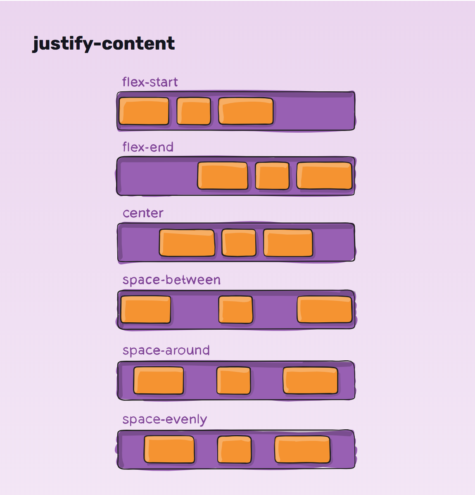
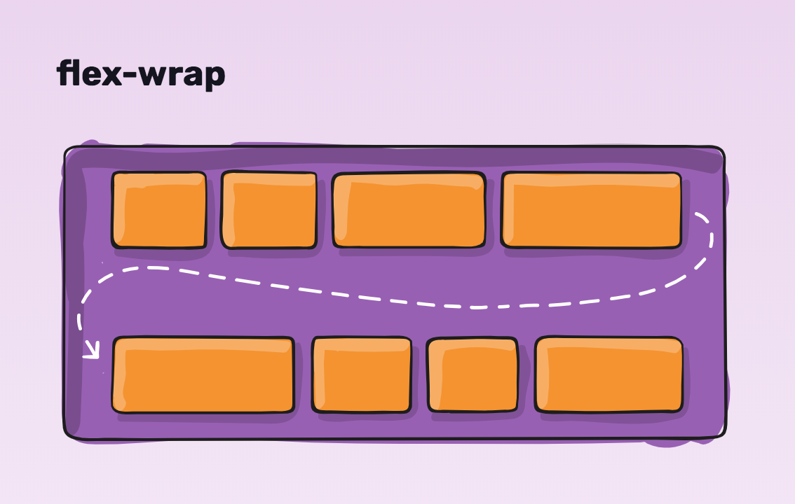

# CSS Flexbox

## Objectives

By the end of this, developers should be able to:

- Apply flexbox to parent elements
- Utilize flexbox properties to parent and child elements
- Build web page layouts using flexbox

## Lab:  Interactive Game

Complete http://flexboxfroggy.com/

## Lab:  Layouts

Use flexbox to complete these common [web page layouts](labs/README.md)

## Additional Resources

- https://css-tricks.com/snippets/css/a-guide-to-flexbox/
- https://demos.scotch.io/visual-guide-to-css3-flexbox-flexbox-playground/demos/